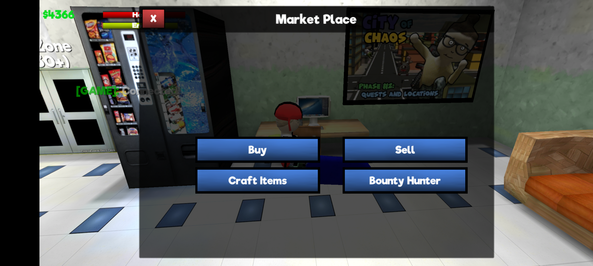
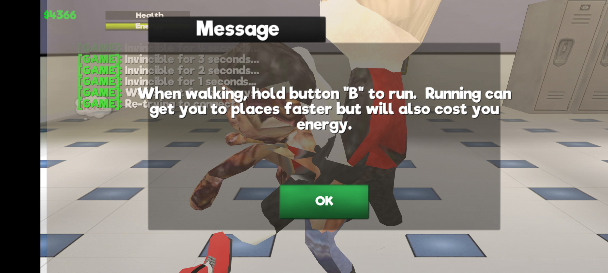

<div align="center">

**CASE // SOC-CLASSIC-01 · INVESTIGATION LOG**

# School of Chaos Classic — Crash-on-Launch Investigation

**A native segfault hiding in a 2017 Unity allocator, exposed by modern Android ASLR —**
**traced from a silent crash to the exact root cause, and confirmed across three unrelated device manufacturers.**

[](https://github.com/contactjayclatty/XJAYs-Soc-Classic-Fix)
[](reports/SoC_Classic_crash_report.txt)
[](reports/SoC_Classic_crash_report.txt)
[](https://github.com/contactjayclatty/XJAYs-Soc-Classic-Fix/releases/tag/v0.3)
[](#confirmed-across-multiple-devices)
[](https://contactjayclatty.github.io/XJAYs-Soc-Classic-Fix/)
[](LICENSE)

**[Investigation site](https://contactjayclatty.github.io/XJAYs-Soc-Classic-Fix/)** ·
**[Crash report](reports/SoC_Classic_crash_report.txt)** ·
**[Download v0.3](https://github.com/contactjayclatty/XJAYs-Soc-Classic-Fix/releases/tag/v0.3)** ·
**[FAQ](https://contactjayclatty.github.io/XJAYs-Soc-Classic-Fix/faq.html)** ·
**[Discord](https://discord.gg/gkYmXkn57Z)**

</div>

---

> [!WARNING]
> **Upstream is still unfixed.** The only real fix is a Unity engine update from
> **VNL Entertainment**. A full technical write-up has already been sent to them
> ([`reports/SoC_Classic_crash_report.txt`](reports/SoC_Classic_crash_report.txt)).
> Until then, an **experimental**, root-only device-side workaround exists —
> helpful, honest about its limits, and **not a guaranteed fix**.

## At a glance

| | |
|---|---|
| **Game** | School of Chaos Classic — VNL Entertainment (`com.vnlentertainment.socclassic`) |
| **Tested version** | 1.822 (build `cea6b550-3db9-4510-864b-a1c2a0089fa7`) |
| **Engine** | Unity **2017.4.34f1** (2018-era), 64-bit only |
| **Symptom** | Silent crash seconds into the loading scene — intermittent, no dialog, no ANR |
| **Signature** | `Using memoryadresses from more that 16GB of memory` → **SIGSEGV** |
| **Root cause** | 2017-era native allocator overflows when ASLR places the heap above ~2³⁴ |
| **Proof** | Disabling ASLR for the process: **10/10 clean launches** (vs. reliable crash streak) |
| **Affected** | Confirmed on **3 manufacturers** — Google, Transsion, Xiaomi (so far) |
| **Workaround** | Experimental Zygisk module **v0.3** — root required, arm64-v8a |

---

## Table of contents

- [The game](#the-game)
- [The crash](#the-crash)
- [Root cause](#root-cause)
- [Why it's intermittent — the ASLR lottery](#why-its-intermittent--the-aslr-lottery)
- [Confirmed across multiple devices](#confirmed-across-multiple-devices)
- [Status](#status)
- [Experimental workaround (module v0.3)](#experimental-workaround-module-v03)
- [Building from source](#building-from-source)
- [Project website](#project-website)
- [Evidence screenshots](#evidence-screenshots)
- [Timeline](#timeline)
- [Repo layout](#repo-layout)
- [FAQ](#faq)
- [How you can help](#how-you-can-help)
- [For VNL Entertainment](#for-vnl-entertainment)
- [Disclaimer](#disclaimer)

---

## The game

**School of Chaos Classic** (`com.vnlentertainment.socclassic`) is a Unity-built,
open-world school-life sim/RPG by VNL Entertainment — players walk around a
schoolyard, complete quests, buy and sell items at the Market Place, and level
up their character. Two shipping details turn out to be directly relevant to
the bug:

- It's built on **Unity 2017.4.34f1**, a 2018-era engine release — years before
  Unity properly supported large 64-bit address spaces on Android.
- It ships **64-bit only** (no `armeabi-v7a` build at all), so every player runs
  the affected native code path on modern devices.

## The crash

The game gets past the splash screen and into the loading scene, then dies
silently back to the home screen — a few seconds in, right as the first asset
bundle (`LoaderScene` / `bundleVer`) loads. No error dialog, no ANR, nothing in
`AndroidRuntime` in most cases. It just disappears.

It was first noticed on a **Pixel 9 Pro XL (16GB RAM)** and initially assumed to
be a high-RAM Pixel problem. **It is not** — the identical crash signature has
since been confirmed on hardware from three unrelated manufacturers
([details](#confirmed-across-multiple-devices)).

Every crash shows the same pattern in `logcat`, regardless of device:

```
Unity   : Using memoryadresses from more that 16GB of memory
```

*(the typo is in the game's own log output)*

…immediately followed by a native crash. On some devices:

```
ActivityManager: Process com.vnlentertainment.socclassic (pid ####) has died: fg TOP
Zygote  : Process #### exited due to signal 11 (Segmentation fault)
```

On others it's caught and re-raised with a real fault address:

```
E/CRASH: signal 11 (SIGSEGV), code 1 (SEGV_MAPERR), fault addr 0000000000119b8c
E/AndroidRuntime: FATAL EXCEPTION: main
E/AndroidRuntime: java.lang.Error: signal 11 (SIGSEGV), code 1 (SEGV_MAPERR), fault addr 0000000000119b8c
```

Either way it's a **native segfault**, not a Java exception. The fault addresses
observed across multiple crash logs are all small, garbage-looking values in a
narrow range (roughly `0x119000`–`0x12A000`) — exactly what you'd expect when a
legitimate large address has its high bits truncated off by a pointer-packing
bug and is then dereferenced.

## Root cause

Pulling the installed APK and inspecting `libunity.so` confirms Unity
**2017.4.34f1**. The crash string sits directly next to Unity's own native
memory allocator's diagnostic strings inside the binary:

```
Could not allocate memory: System out of memory!
Trying to allocate: %zuB with %zu alignment. MemoryLabel: %s
Allocation happend at: Line:%d in %s
[ %s ] used: %zuB | peak: %zuB | reserved: %zuB
Using memoryadresses from more that 16GB of memory
```

So this is not IL2CPP's GC — it's Unity's own native memory manager. That
2017-era allocator packs its allocation bookkeeping assuming addresses stay
under roughly **16GB (2³⁴)** of address space. On a 64-bit process, Android's
ASLR decides where the app's heap lands on every launch. When it lands **above**
that threshold, the packed pointer representation overflows, corrupting memory —
and the app segfaults moments after logging that warning:

```
0x0                                            ~2³⁴ (16GB)                    2⁶⁴
 ┌────────────────────────────────────────────────┬─────────────────────────────→
 │                                                │
 │   SAFE — allocator's packed pointers resolve   │   OVERFLOW — high bits truncated;
 │                                                │   bookkeeping corrupts → SIGSEGV
 └────────────────────────────────────────────────┴─────────────────────────────
                                                   ▲
                          unlucky ASLR roll lands the game's heap here
                          (crash fires at first asset-bundle allocation)
```

> [!NOTE]
> **Refined understanding.** This was initially framed as a "16GB+ RAM phones"
> issue, since it first showed up reliably on a 16GB Pixel. Having now seen the
> identical crash on devices from other manufacturers where the RAM tier isn't
> confirmed to be 16GB, the more accurate framing is that this is tied to
> **Android's ASLR address-space entropy in general** — which has trended upward
> across Android versions. More RAM likely still correlates with higher risk
> (larger internal reservations are more likely to land in higher, less-crowded
> address regions), but newer/higher-entropy Android builds appear to be the
> broader common factor.

## Why it's intermittent — the ASLR lottery

ASLR re-randomizes the heap's placement on **every cold start**. Land under the
~2³⁴ line and the game runs fine; land above it and it crashes within seconds.
Same device, same install, different luck — which is exactly why the crash
looked flaky at first.

This was **proven with a live test**, not just inferred: with ASLR disabled for
just the game's process (`personality(ADDR_NO_RANDOMIZE)`) on the rooted test
device, the game launched **10 times in a row — 10/10, zero crashes** — versus a
reliable crash streak immediately beforehand with ASLR on. Address randomization
is the confirmed trigger.

## Confirmed across multiple devices

| # | Manufacturer / device family | Evidence | Notes |
|---|---|---|---|
| 1 | **Google** — Pixel 9 Pro XL, 16GB RAM | ✅ Exact signature + **live ASLR-disable proof** | Where the bug was first identified and diagnosed in depth |
| 2 | **Transsion** — Tecno/Infinix/itel-family | ✅ Exact signature, **7 crashes** in one log capture | Not rooted, no workaround — raw bug reproducing |
| 3 | **Xiaomi** — MIUI | ✅ Exact signature, **3 crashes** in one log capture | Not rooted, no workaround — raw bug reproducing |

All three show the identical `Using memoryadresses from more that 16GB of
memory` line immediately preceding a native segfault. None of the non-Pixel
reports had root or any workaround installed — this is the raw, unmodified bug,
not something specific to one OEM's Android build or one person's configuration.

## Status

| Item | State |
|---|---|
| Upstream fix (VNL / Unity update) | **None yet** |
| Root cause | ✅ Identified |
| Proven trigger | ✅ ASLR-dependent (10/10 live test) |
| Reported to VNL | ✅ Yes — [`reports/SoC_Classic_crash_report.txt`](reports/SoC_Classic_crash_report.txt) |
| Experimental module | 🟡 **[v0.3 live](https://github.com/contactjayclatty/XJAYs-Soc-Classic-Fix/releases/tag/v0.3)** — experimental, not guaranteed |

**The only real fix has to come from VNL Entertainment** — specifically,
updating the game's Unity engine version. Later Unity releases rewrote this
allocator to handle 64-bit address spaces correctly, which is exactly why this
bug class doesn't exist in modern Unity builds. Until that happens, the
community device-side workaround below exists for people who accept its limits.

## Experimental workaround (module v0.3)

A **root-only Zygisk module** disables ASLR for just the game's process, via
`personality(ADDR_NO_RANDOMIZE)` in Zygisk `preAppSpecialize` — keeping the heap
address low and stable so it never lands in the overflow zone. It targets one
package name, hooks nothing else, and unloads itself from the process
immediately after:

```cpp
static const char *TARGET_PKG = "com.vnlentertainment.socclassic";

void preAppSpecialize(AppSpecializeArgs *args) override {
    // if process == TARGET_PKG:
    personality(prev | ADDR_NO_RANDOMIZE);                  // ASLR off, this process only
    api->setOption(zygisk::Option::DLCLOSE_MODULE_LIBRARY); // then unload — nothing stays resident
}
```

*(full source: [`archive/module/jni/socfix.cpp`](archive/module/jni/socfix.cpp) — 52 lines total)*

| | |
|---|---|
| **Release** | **[v0.3](https://github.com/contactjayclatty/XJAYs-Soc-Classic-Fix/releases/tag/v0.3)** (2026-07-13) |
| **Package** | `socfix_module.zip` · id `socfix_vnl` · versionCode `3` |
| **ABI** | arm64-v8a |
| **Requirements** | Root + Zygisk (KernelSU, or Magisk with Zygisk enabled) |
| **Verified on** | Pixel 9 Pro XL + KernelSU (primarily) |
| **VirusTotal** | **0/65** engines flagged |
| **Download** | [Release page](https://github.com/contactjayclatty/XJAYs-Soc-Classic-Fix/releases/tag/v0.3) · [Site download page](https://contactjayclatty.github.io/XJAYs-Soc-Classic-Fix/download.html) |

> [!CAUTION]
> **Not a guaranteed fix.** The module showed promising results in testing, but
> in one run the mitigation was confirmed active and the game **still crashed**.
> OEMs where the crash is confirmed (Transsion, Xiaomi) were never tested with
> this module. Install at your own risk.

### Install

1. Download [`socfix_module.zip`](https://github.com/contactjayclatty/XJAYs-Soc-Classic-Fix/releases/download/v0.3/socfix_module.zip)
2. Root manager → **Modules** → **Install from storage** → pick the zip
3. Reboot, launch the game
4. Optional verification: `logcat` filter `SocFix` should show ASLR disabled for the package

### Module history

| Version | Date | Notes |
|---|---|---|
| **v0.3** (current) | 2026-07-13 | **Reverted** the experimental `/proc/meminfo` spoof secondary mitigation (SELinux walls in zygote: mounton denial, memfd bind `EINVAL`, then silent read denial). ASLR-only again. **Pinned** the `libcxx` submodule to `82090ae7` (NDK r27-compatible) so clean clones build. VT 0/65. |
| v0.2 | 2026-07-13 | Intermediate public release; superseded after the meminfo experiment was pulled. |
| v0.1 | 2026-07-13 | Initial Zygisk module — ASLR off for the game process only. |

## Building from source

The module source ships in [`archive/module/`](archive/module/) for anyone who
wants to build or experiment instead of trusting a prebuilt zip:

```bash
git clone --recurse-submodules https://github.com/contactjayclatty/XJAYs-Soc-Classic-Fix.git
cd XJAYs-Soc-Classic-Fix/archive/module
ndk-build        # run from archive/module/, NOT archive/module/jni/
```

Notes:

- `--recurse-submodules` is **required** — `jni/libcxx` is a submodule
  ([topjohnwu/libcxx](https://github.com/topjohnwu/libcxx), pinned to `82090ae7`
  for NDK r27 compatibility). Without it the build fails.
- Output lands in `archive/module/libs/`; package it with `package/module.prop`
  into a flashable zip (see [`archive/dist/`](archive/dist/) for the last build).
- Build intermediates (`obj/`, `libs/`) are gitignored.

## Project website

A full multipage investigation site lives at
**[contactjayclatty.github.io/XJAYs-Soc-Classic-Fix](https://contactjayclatty.github.io/XJAYs-Soc-Classic-Fix/)**
(served from [`docs/`](docs/) via GitHub Pages), styled as a technical incident
report (`CASE // SOC-CLASSIC-01`):

| Page | Contents |
|---|---|
| [Home](https://contactjayclatty.github.io/XJAYs-Soc-Classic-Fix/index.html) | The full walkthrough — symptom, logs, root cause, an address-space diagram, device evidence |
| [Status](https://contactjayclatty.github.io/XJAYs-Soc-Classic-Fix/status.html) | Where things stand, what a real fix requires, how the module fits in |
| [Download](https://contactjayclatty.github.io/XJAYs-Soc-Classic-Fix/download.html) | v0.3 package, requirements, install steps, preflight disclaimer modal |
| [FAQ](https://contactjayclatty.github.io/XJAYs-Soc-Classic-Fix/faq.html) | 8 common questions about the crash and the investigation |
| [Contact](https://contactjayclatty.github.io/XJAYs-Soc-Classic-Fix/contact.html) | How to report your device |

## Evidence screenshots

The game running normally on the test device (Pixel 9 Pro XL) after a
successful launch:

<table>
  <tr>
    <td></td>
    <td></td>
  </tr>
  <tr>
    <td align="center"><sub>In-game after a successful launch — Market Place UI open</sub></td>
    <td align="center"><sub>Tutorial dialog in-game on the test device</sub></td>
  </tr>
</table>

## Timeline

| Date | Event |
|---|---|
| 2026-07-13 | Module v0.1 built (ASLR-off) → v0.2 → **v0.3** (meminfo spoof reverted, libcxx pinned) |
| 2026-07-14 | Repo goes public: investigation report, module source, MIT license, first site, VirusTotal results |
| 2026-07-15 | Repo repositioned as an **issue investigation** (not a fix distribution); site rebuilt with the incident-report aesthetic |
| 2026-07-18 | **v0.3 release published**, dedicated Download page, module documented in this README |
| Ongoing | Collecting cross-device reports; upstream fix pending with VNL |

## Repo layout

```
reports/       Crash investigation write-up addressed to the game's developers
archive/       Zygisk module source, build files, last built zip, archived-work notes
docs/          Project website (GitHub Pages) — Home, Status, Download, FAQ, Contact
screenshots/   In-game evidence captures from the test device
LICENSE        MIT
```

Raw full-device logcat dumps (`logs/`) are gitignored — they're huge and mostly
unrelated system noise; the relevant excerpts are already captured in
[`reports/`](reports/).

## FAQ

**Is there a fix I can install right now?**
No *confirmed* fix — upstream still needs a Unity update from VNL. The
[experimental module](#experimental-workaround-module-v03) may reduce crashes
but was never proven to eliminate them, and it requires root + Zygisk.

**Is this only on Pixel phones / 16GB RAM devices?**
No. That was the original theory (first seen on a 16GB Pixel 9 Pro XL), but the
identical signature is confirmed on Transsion and Xiaomi hardware with
unconfirmed RAM tiers. It's about ASLR entropy in general, not a RAM cutoff.

**Why does it only crash sometimes?**
ASLR re-randomizes heap placement every launch. Sometimes the heap lands under
the problematic threshold (game runs), sometimes above it (instant crash). It's
bad luck per cold start, not your install.

**Does this project modify the game's APK?**
No. Nothing here modifies, redistributes, or cracks the APK or its assets. The
module only changes an OS-level process flag (ASLR) for that one package name.

Full FAQ (8 entries): **[project site → FAQ](https://contactjayclatty.github.io/XJAYs-Soc-Classic-Fix/faq.html)**.

## How you can help

The more device diversity we can document, the stronger the case for VNL
Entertainment to prioritize a real fix. If you're hitting this crash:

1. Grab a `logcat` capture around the crash (filtered to
   `com.vnlentertainment.socclassic` is fine)
2. Share it via [an issue](https://github.com/contactjayclatty/XJAYs-Soc-Classic-Fix/issues/new)
   or the [Discord](https://discord.gg/gkYmXkn57Z)
3. Include your device model/manufacturer and RAM if you know it — and whether
   you tried the module

No root or technical setup required just to report — the log alone is genuinely
useful.

## For VNL Entertainment

Everything you need is in
[`reports/SoC_Classic_crash_report.txt`](reports/SoC_Classic_crash_report.txt):
the symptom, the exact engine version and allocator strings, the live
ASLR-disable proof, a full timestamped crash log, and the specific fix direction
(use the full 64-bit address instead of the truncated/packed representation, or
detect addresses above the assumed ceiling and retry instead of corrupting the
pointer). A Unity version bump resolves this entire bug class — which will only
affect more players as high-RAM, high-entropy devices become the norm.

## Disclaimer

**I am not affiliated with, endorsed by, or acting on behalf of VNL
Entertainment in any way.** This is an independent, unofficial investigation put
together by a player, not a developer of the game. It exists solely to document
and help get fixed a crash-on-launch issue — it is not a mod, a cheat, a
cracking tool, or a way to unlock/change anything about the game. No APK is
modified, redistributed, or cracked as part of this project. The experimental
Zygisk module only changes an OS-level process flag (ASLR) for that one package
name.

If VNL Entertainment fixes this upstream, this project's job is done — that's
the actual goal here, not maintaining a workaround indefinitely.

---

<div align="center">

**[MIT License](LICENSE)** · Independent, unofficial investigation · Not affiliated with VNL Entertainment

</div>
